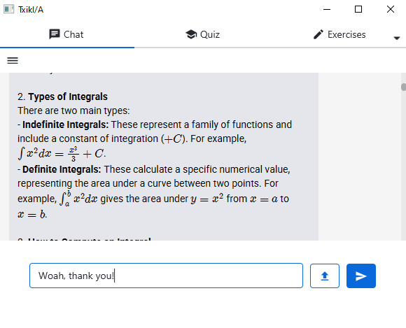

# TxikIA

> *(Psst... looking for the [sprint info](#information-for-software-engineering-class) in the Software Engineering project?)*

---

## About TxikIA

TxikIA is an AI-powered math assistant, designed with students in mind. It offers various features, such as:

- Asking questions about theory and practice, and uploading class notes or exercises for further analysis.
- Generate 4-answer quizzes, and try to answer them correctly! TxikIA will offer useful feedback for each answer.
- Answer to open-ended questions, as if you were in an exam, and get detailed feedback on your rights, your wrongs and your points of improvement, all in a visual and interactive fashion.
- Generate SageMath code and execute it on its own environment!
- Organize your tasks into projects

---

## Executing TxikIA

1. **Refresh Maven dependencies** to download all the required libraries for this project to work.
2. Open the `llm_handler/APIRequestHandler.java` class, and replace:
    - `"INSERT GEMINI KEY"`
    - `"INSERT DEEPSEEK KEY"`  
      with your own personal API keys for these AI models.
   > *We expect to change this in the future, offering a more intuitive way of setting up the API keys in the UI.*

3. Execute the `main` method in `presentation/EntryPoint.java`, and sign up or log in to the software.

**NOTE:**  
For the time being, DB management is manual. If it's your first time loading the TxikIA software:
- Open the `hibernate.cfg.xml` file
- Set `hibernate.hbm2ddl.auto` to `create`

After the first time, change it to `validate` (otherwise, your database will be destroyed on each run).

---

## Information for Software Engineering class

### Team Name

**Antoñana Coding Corp.**

### Team Members

- Mikel Bilbao
- Mikel Berasategui
- Beñat Descalzo

---

## Sprint 1 Description

### Some information and documentation (requirement analysis) about TxikIA, an AI-assisted math helper for students. This documentation has been saved in the `docs` folder in GitHub and includes:

- Wording (description of the project)
- Use Case diagram
- Domain model
- Extended event flows (for 4 different use cases)
- UI mockup

### Apart from the documentation, some code has been implemented:

- Register implementation and its storing in databases
- Login implementation with the help of databases
- Creation and storage of a user's projects on a database

---

## Sprint 2 Description

### The errors made in Sprint 1 have been fixed. Also, the information and documentation section of the Project has been completed with some new documentation:

- Sequence Diagram of the "Edit Project" Use Case.
- More information about how APIs are implemented in the Project.

### However, the main work has been done in the implementation section. This work has been made in a new branch (called `dev`). This code implementation includes:

- "Create Project" Use Case implementation.
- "Edit Project" Use Case implementation.
- "Delete Project" Use Case implementation.
- "Log Out" Use Case implementation.
- "Change Project Name" Use Case implementation.
- "Open Project" Use Case implementation.
- "Talk with AI" Use Case partial implementation.
- User onboarding implementation.
- Improvement of the UI look, functionality and usability.
- Some implementation of API calls, functionalities, and prompt formalization.
